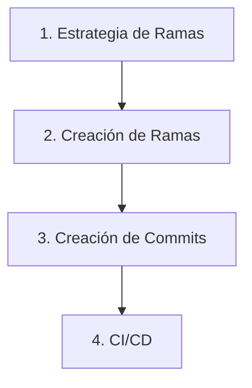

# 🔹 Flujo de trabajo de desarrollo de software

Esto es una guía estructurada basada en mi experiencia trabajando en equipos de desarrollo, para establecer un flujo de trabajo profesional y automatizado en proyectos de desarrollo de software, desde la creación de ramas hasta la publicación automática de `releases` y ejecución de pruebas y validaciones automaticas.

## 🔹 1. Propósito de este flujo de trabajo

Este proyecto proporciona un flujo de trabajo completo para implementar mejores prácticas en el desarrollo colaborativo de software. Combina metodologías probadas de gestión de código fuente, convenciones de `commits` estandarizadas y automatización de CI/CD para crear un flujo de trabajo coherente y escalable.

### 1.1. ¿Qué problemas resuelve?

- **Inconsistencia en el historial de cambios:** Estandariza cómo se documentan las modificaciones.
- **Gestión manual de versiones:** Automatiza la creación de `releases` y `changelogs`.
- **Falta de trazabilidad:** Vincula cada cambio con su propósito específico.
- **Despliegues manuales propensos a errores:** Automatiza el proceso completo de CI/CD.
- **Colaboración desorganizada:** Establece reglas claras para todo el equipo.

### 1.2. ¿Qué obtienes al implementarlo?

- ✅ **Historial de commits legible y profesional**.
- ✅ **Versionado semántico automático**.
- ✅ **Changelogs generados automáticamente**.
- ✅ **Pipeline de CI/CD lista para usar**.
- ✅ **Despliegues automatizados y confiables**.
- ✅ **Flujo de trabajo escalable para equipos de cualquier tamaño**.

## 🔹 2. Orden de Lectura Recomendado

Para comprender e implementar correctamente este flujo de trabajo, es importante seguir las guías en el orden indicado. Cada paso construye sobre el anterior: primero entenderás la estrategia de ramas que define cómo organizar el trabajo, luego aprenderás las convenciones para nombrar ramas y escribir commits, y finalmente configurarás la automatización que aprovecha todo lo anterior.

### Paso 1: Estrategia de Ramas

Comprende la estructura de ramas del proyecto y las estrategias de merge. Este es el fundamento de todo el flujo de trabajo.

📖 **[Estrategia de Ramas →](guides/branching_strategy.md)**

---

### Paso 2: Creación de Ramas de Trabajo

Aprende a crear ramas de trabajo siguiendo las convenciones establecidas.

📖 **[Creación de Ramas →](guides/create_branch.md)**

---

### Paso 3: Creación de Commits

Implementa convenciones de `commits` que permitan automatizar el versionado y la generación de `changelogs`.

📖 **[Creación de Commits →](guides/create_commit.md)**

---

### Paso 4: Configuración de CI/CD

Implementa pipelines de CI/CD que automaticen pruebas, despliegues y publicación de `releases`.

| Plataforma | Documentación |
|------------|---------------|
| **GitHub Actions** | 📖 **[Configuración para GitHub →](ci_cd/github/README.md)** |
| **GitLab CI/CD** | 📖 **[Configuración para GitLab →](ci_cd/gitlab/README.md)** |
